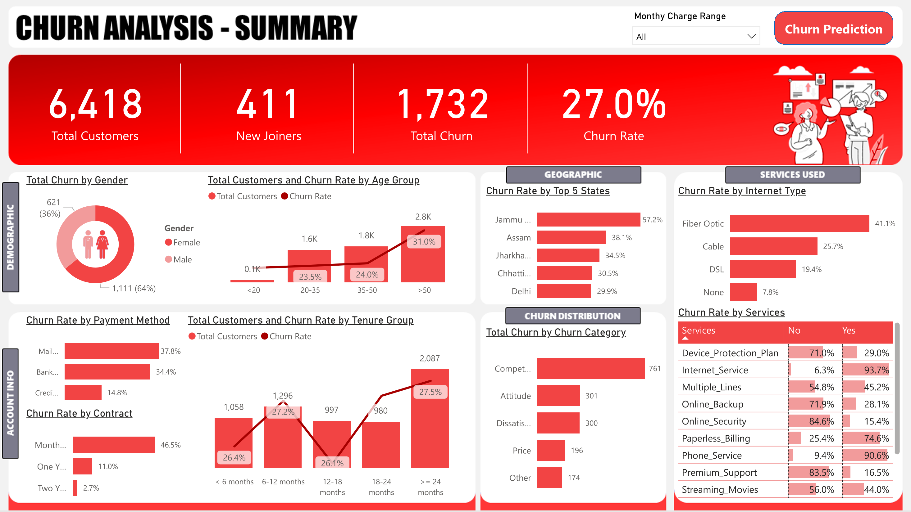
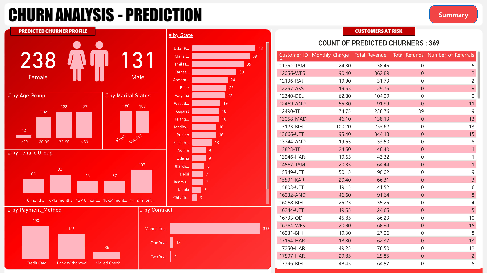

# Telecom Churn Analysis & Prediction 📊

An end-to-end analytics project to explore customer churn in the telecom sector, visualize trends, and predict future churners using machine learning.

---

## 🔍 Overview

This project includes:
- ETL process using **SQL Server**
- Interactive churn summary dashboards with **Power BI**
- Churn prediction using **Random Forest** (via **scikit-learn** in **Python**)
- Customer-level churn prediction output integrated into a second dashboard

---

## 🧰 Tools & Technologies

- **SQL Server** – data cleaning, transformation, and view creation  
- **Power BI** – visual dashboards using Power Query and DAX  
- **Python** – `pandas`, `scikit-learn`, `matplotlib`, `seaborn` for ML modeling  
- **Jupyter Notebook** – for code experimentation and modeling

---

## 📊 Dashboards Preview

### 📌 Churn Summary Dashboard

Shows customer segmentation, churn rate by demographics, payment methods, tenure, contracts, and churn reasons.

---

### 🔮 Churn Prediction Output Dashboard

Displays customers predicted to churn using the trained model, segmented by age group, contract type, and more.

---

## ⚙️ Machine Learning Highlights

- Model: **RandomForestClassifier** (`scikit-learn`)
- Target variable: `Customer_Status` (Churned / Stayed)
- Features selected based on domain knowledge and importance analysis
- Final output: **369 predicted churners**, exported to CSV and visualized in Power BI
